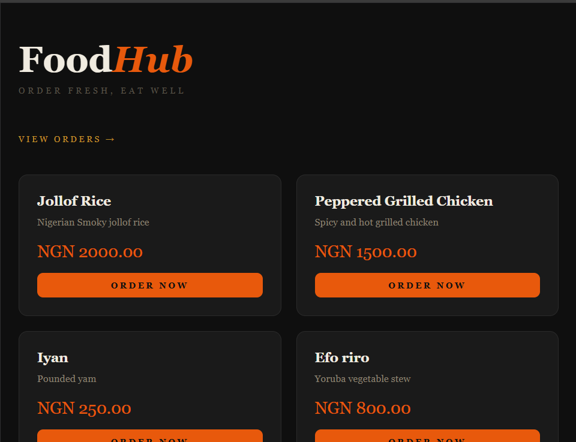

# FoodHub — Food Ordering App

A full-stack food ordering web application built with Django. Manage a menu, place orders, and track order status from pending to delivered.

<p align="center">
  
</p>

## What it does

- Browse available menu items
- Place orders with the customer's name and quantity
- View all incoming orders in real time
- Update order status: Pending → Confirmed → Delivered
- Full admin panel to manage menu items and orders

## Tech Stack

- Python 3
- Django 6 — web framework
- SQLite — database
- Django Admin — menu and order management

## Running Locally
```bash
python -m venv venv
venv\Scripts\activate
pip install django
python manage.py migrate
python manage.py createsuperuser
python manage.py runserver
```

Visit `http://127.0.0.1:8000` for the menu and `http://127.0.0.1:8000/admin` to manage items.

## Key Concepts

- Django ORM with ForeignKey relationships
- Class-based model methods
- Django Admin registration
- Template rendering with Jinja2
- URL routing across multiple views

## Author

**Omobolanle Sadela**  
[GitHub](https://github.com/bolanlesadela) · [LinkedIn](https://www.linkedin.com/in/omobolanle-sadela-7a486a1b4/)
